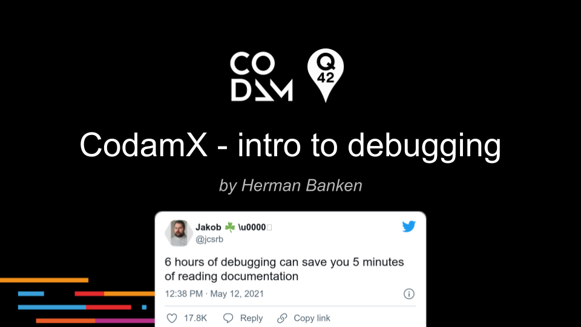

# Intro to Debugging
A small guide how to get familiar with debugging!

Slides:

Examples (make sure to open each VS Code for each individual directory):

1. [debugging-c](./debugging-c) Example program in C (atoi) with a bug, and the VSCode settings to launch in debug mode.
1. [debugging-go](./debugging-go) Example of 3 microservices in Golang, sending traces via OpenTelemetry. Deploys to Google CloudRun.
1. [profiler](./profiler) Example of Golang program doing some 'heavy' work, which can be visualized in the profiler.
